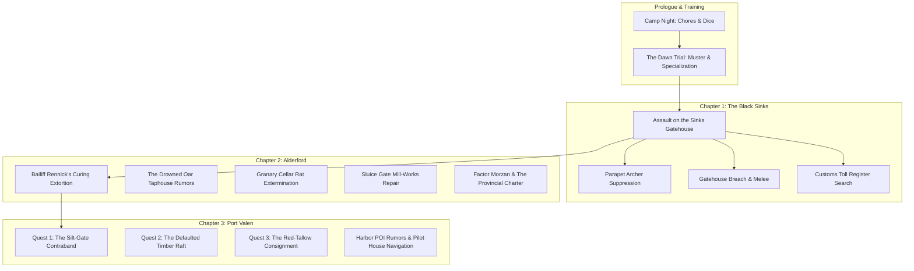

# Quests & Contracts Reference — The Carrion Company

A developer reference for every major quest, side contract, municipal task, and investigation across *A Mercenary's Path*. Keep this updated whenever a new quest, objective stage, or resolution branch is added.

---

## Quest State Architecture & Standards

All quests use standardized ChoiceScript lifecycle variables declared in `startup.txt`:
1. **Stage Flag (`[quest_name]_quest_stage`):**
   - `"unstarted"` — Initial state before the briefing, notice, or trigger event.
   - `"active"` — Accepted / ongoing; unlocks investigation choices, district travel goals, and POI scenes.
   - `"resolved"` — Finished; locks out repeatable investigation branches and updates district ambient prose.
2. **Resolution Flag (`[quest_name]_resolution`):**
   - Stores the narrative path taken (e.g. `"watch_seized"`, `"tally_bribed"`, `"vane_diverted"`, `"scales_extorted"`).
3. **Intel & Evidence Flags:**
   - Tracks discovered clues, stolen manifests, or extracted names (`[quest_name]_full_intel`, `found_customs_vellum`, etc.).
4. **Reward & Claim Flags:**
   - One-time payout protection (`[quest_name]_bounty_claimed`), reputation boosts (`port_watch_rep`, `gilded_scales_rep`, `black_tally_rep`, `vane_standing`), and unique items (`has_silt_gate_iron`).

---

## Chapter Overview



---

## Chapter 1: The Black Sinks (`battle_black_sinks.txt`)

### 1. Assault on the Sinks Gatehouse
* **Scene File:** `battle_black_sinks.txt`
* **Briefing / Origin:** Captain Vane & squad sergeants prior to the causeway charge.
* **Core Objectives:**
  1. Cross the flooded mud-causeway under missile fire.
  2. Suppress the parapet archers and defensive barricades.
  3. Breach the iron-studded oak gatehouse and break the defending line.
* **Investigation / Sub-Objectives:**
  * **Search the Sinks Toll-House (`bivouac_search`):** Search the water-damaged office to recover the *Grey Waterway Toll Register* vellum (`found_customs_vellum = true`).
  * **Repair with Magic:** Use `[Cantrip: Mending]` to restore the torn vellum and salt-soaked seals.
* **Key Variables:**
  * `found_customs_vellum` (boolean) — Held in pack for leverage in Chapter 2 (Alderford).
  * `customs_register_restored` (boolean) — Repaired via Mending or careful drying.

---

## Chapter 2: Alderford River Hub (`alderford.txt`)

### 1. The Fish-Curing Lofts Extortion
* **Scene File:** `alderford.txt` (`alderford_fish_curing`)
* **Briefing:** River workers cornered by Bailiff Rennick and two iron-cudgel thugs shaking down the drying lofts for illegal toll-tribute.
* **Resolution Paths:**
  1. **Provincial Charter Leverage:** Slam the *Grey Waterway Toll Register* onto the salting bench (`found_customs_vellum`), citing Section 12 to expose Rennick's debt as unsanctioned extortion (Automatic Success).
  2. **Thaumaturgy / Arcane Intimidation:** Booming command with violet flaring lantern light (`CHA DC 10` / Tiefling / Spellcaster).
  3. **Martial Feat of Strength:** Snap a 3-inch oak curing beam barehanded (`STR DC 10` / Fighter / Barbarian).
  4. **Sleight of Hand Disarm:** Slice Rennick's purse-strings and kick his lead guard's knee (`DEX DC 10` / Rogue).
  5. **Physical Combat:** Full squad brawl against Rennick's cudgel-men (`combat.txt`).
* **Rewards:** +10–18 Silver Marks, Alderford worker regard, unlocks Gilded Scales leverage.

### 2. The Granary Cellar Infestation
* **Scene File:** `alderford.txt` (`alderford_granary`)
* **Briefing:** Mill master offers silver to clear aggressive bog-rats nesting beneath grain chutes.
* **Resolution Paths:**
  1. Tactical extermination / rat combat (`combat.txt` — `fight_granary_rats`).
  2. Trapping and barrier construction (`INT DC 11` / `DEX DC 11`).
* **Rewards:** +12 Silver Marks, clean meal rations.

### 3. Factor Morzan & The Provincial Charter
* **Scene File:** `alderford.txt` (`alderford_counting_house`)
* **Briefing:** Deliver the recovered Black Sinks Toll Register to the Gilded Scales counting house.
* **Resolution Paths:**
  1. Turn in the vellum for full guild contract price (+40 Silver Marks, `+2 gilded_scales_rep`).
  2. Leverage the tax skims to secure merchant concessions for the Carrion Company supply train.
* **Variables:** `turned_in_customs_vellum = true`.

---

## Chapter 3: Port Valen Municipal Quests (`port_valen.txt`)

### Quest 1: The Silt-Gate Contraband
* **Scene File:** `port_valen.txt` (`pv_dredge_silt_gates`, `pv_silt_gate_stakeout`, `pv_silt_gate_ambush_watch`, `pv_silt_gate_parley_tally`, `pv_silt_gate_divert_vane`)
* **District:** Dredge-End (Low drainage flume & tidal vault).
* **Briefing:** Harbor Watch Commander Voss reports uninspected highland shear-steel and illicit peat-spiritus entering through the tidal flap-valves during midnight flood tides.

#### Objective Flow:
1. **Daytime Recon (`pv_dredge_silt_gates`):**
   * Map roofline blind spots and spot the lantern-boy (`silt_gate_lookout_spotted = true`).
   * Jam the street-level storm-winch counterweight cog (`silt_gate_winch_jammed = true`).
   * Study high-tide charcoal marks on the stone vault.
   * `[Cantrip: Mage Hand]` — Remotely wedge an iron bolt into the winch cog from the canal shadows.
2. **Night Stakeout Prep (`pv_silt_gate_stakeout`):**
   * Wait for night flood tide (`[~2 Hours]`).
   * `[Cantrip: Guidance]` — Divination focus buff (`+1d4` to next check).
   * `[Cantrip: Prestidigitation]` — Snuff the platform's fish-oil lamp from afar (`silt_gate_lamp_snuffed = true` ➔ Advantage on ambush).
   * `[Cantrip: Minor Illusion]` — Project false patrol footsteps down the north cut (`silt_gate_illusion_active = true` ➔ Advantage on ambush).
3. **Three Resolution Branches:**

| Branch | Mechanics & Spells | Outcome & State |
|---|---|---|
| **Branch A: Ambush for the Watch** (`pv_silt_gate_ambush_watch`) | • `[STR DC 12]` / `[DEX DC 12]` / `[INT DC 11]`<br>• `[Cantrip: Shocking Grasp]` (Advantage, `INT DC 11`)<br>• `[Cantrip: Ray of Frost]` (Freeze rudder, `INT DC 11`)<br>• `[Spell: Magic Missile]` (1 Slot, Auto-Success) | Seizes steel for Commander Voss.<br>`silt_gate_resolution = "watch_seized"`<br>+20 Silver bounty from Voss (`+2 port_watch_rep`). |
| **Branch B: Parley & Bribe** (`pv_silt_gate_parley_tally`) | • `[CHA DC 12]` / `[WIS DC 11]` / `[INT DC 11]`<br>• `[Cantrip: Thaumaturgy]` (`CHA DC 10`, 30 Silver Marks)<br>• `[Spell: Charm Person]` (1 Slot, 25 Silver Marks)<br>• `[Spell: Disguise Self]` (1 Slot / Hexblood, 25 Silver Marks) | Shakes down Black Tally broker for silver cut.<br>`silt_gate_resolution = "tally_bribed"`<br>`+1 black_tally_rep`, +15–30 Silver Marks. |
| **Branch C: Divert to Armory** (`pv_silt_gate_divert_vane`) | • `[CHA DC 12]` / `[STR DC 12]` / `[WIS DC 11]`<br>• `[Cantrip: Thaumaturgy]` (`CHA DC 10`)<br>• `[Spell: Dissonant Whispers]` (1 Bard Slot, Auto-Intel) | Diverts 50 lbs highland tool-steel to Company forge.<br>`silt_gate_resolution = "vane_diverted"`<br>`has_silt_gate_iron = true`<br>`silt_gate_full_intel = true`<br>`+1 vane_standing`, `+1 port_watch_rep`. |

---

### Quest 2: The Defaulted Timber Raft
* **Scene File:** `port_valen.txt`
* **District:** Upper Wharves ➔ Civic Heights ➔ Iron Wharves Drydocks.
* **Briefing:** A massive raft of seasoned highland pine is chained to the outer booms under contested lien between the Guild of Shipwrights and a bankrupt timber factor.
* **Planned Flow:**
  1. Inspect the chained boom timber in Upper Wharves.
  2. Search municipal court ledgers in Civic Heights for the original lien bond.
  3. Negotiate or sabotage the drydock slipway in Iron Wharves to divert the timber to the Carrion shipwright contract.
* **Variables:** `timber_raft_quest_stage`, `timber_raft_resolution`.

---

### Quest 3: The Red-Tallow Consignment
* **Scene File:** `port_valen.txt`
* **District:** Dredge-End ➔ Harbor POIs (Pilot House & Tide-Well Shrine).
* **Briefing:** A sealed barge carrying military tallow, pitch, and saltpeter is adrift near the harbor sandbar with a dead crew and forged customs stamps.
* **Planned Flow:**
  1. Board the quarantined barge off the Dredge-End mud-berm.
  2. Inspect the chemical/tallow cargo for alchemical tampering.
  3. Resolve ownership between the Harbor Pilot House and Guild factors.
* **Variables:** `red_tallow_quest_stage`, `red_tallow_resolution`.

---

## Harbor POIs & Minor Contract Log

| Location | Quest / Activity | Requirements / Triggers | Rewards |
|---|---|---|---|
| **The Cleaved Keel Taphouse** | Tavern Dice Gambling & Port Valen Rumors | Open after Vane briefing (`pv_pois_open`) | Up to 15 Silver Marks, 3 unique district rumors |
| **Fishmongers' Slip** | Eel & Smoked Fish Rations, High-Flood Gossip | Day-dependent street life | Rations (reduces hunger neglect) |
| **Sail-Loft Ropes** | Rigging repairs, tarred hemp cordage, climbing gear | Open during daytime hours | Rigging tools for Sapper / Rogue checks |
| **Harbor Pilot House** | Tidal charts, channel navigation, barge clearance | Requires `port_watch_rep >= 1` or `gilded_scales_rep >= 1` | Tidal navigation advantages |
| **Tide-Well Shrine** | Tallow candle offerings, sea-priest blessings | Open all hours | Moral focus / Guidance blessings |

---

## Complete Variables Index

```choicescript
*create silt_gate_quest_stage "unstarted"     *comment "unstarted", "active", "resolved"
*create silt_gate_resolution "none"           *comment "watch_seized", "tally_bribed", "vane_diverted"
*create silt_gate_lookout_spotted false       *comment daytime recon reward
*create silt_gate_winch_jammed false          *comment daytime recon reward / mage hand
*create silt_gate_recon_done false            *comment tracks daytime scout completion
*create silt_gate_lamp_snuffed false          *comment prestidigitation stakeout buff
*create silt_gate_illusion_active false       *comment minor illusion stakeout buff
*create silt_gate_full_intel false            *comment both corrupt watch names discovered
*create silt_gate_bounty_claimed false        *comment one-time 20 silver watch payout guard
*create has_silt_gate_iron false              *comment tool-steel secured for company forge
*create port_watch_rep 0                      *comment municipal guard standing
*create black_tally_rep 0                     *comment canal smuggling network standing
*create gilded_scales_rep 0                   *comment merchant guild monopoly standing
*create vane_standing 0                       *comment mercenary company captain regard
```
