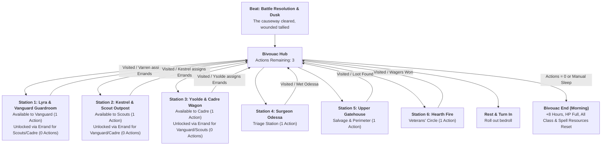

# Story & Scene Blueprint: Post-Battle Bivouac at the Black Sinks

**Scene File:** [`web/mygame/scenes/battle_black_sinks.txt`](file:///c:/Users/Kwesey/Desktop/choicescript-main/web/mygame/scenes/battle_black_sinks.txt)  
**Campaign Timeline:** Day 2 (13:00 Arrival, 14:00 Cleared, 14:00–18:00 Fatigue Duty, 18:00 Dusk Bivouac) to Day 3 (05:15 Pre-Dawn Departure)  
**Setting:** The shelled stone gatehouse at the northern terminus of the Black Sinks Causeway.

---

## 1. Scene Architecture & Master Flowchart

---

## 2. Global State & Tracking Variables

| Variable | Type | Default | Description & Unlocks |
| :--- | :--- | :--- | :--- |
| `bivouac_actions_left` | `number` | `3` | Number of camp exploration activities permitted before forced rest. |
| `visited_bivouac_lyra` | `boolean` | `false` | Tracks whether the player has visited Lyra in the guardroom. |
| `visited_bivouac_kestrel`| `boolean` | `false` | Tracks whether the player visited Kestrel on the perimeter. |
| `visited_bivouac_ysolde` | `boolean` | `false` | Tracks whether the player visited Ysolde at the Cadre wagon. |
| `visited_bivouac_odessa` | `boolean` | `false` | Tracks whether the player visited Surgeon Odessa in triage. |
| `visited_bivouac_search` | `boolean` | `false` | Tracks whether the player explored the ruined upper floor. |
| `visited_bivouac_fire`   | `boolean` | `false` | Tracks whether the player joined the hearth fire circle. |
| `errand_kestrel_unlocked`| `boolean` | `false` | Set when your squad officer assigns a dispatch to Kestrel (0 action cost). |
| `errand_ysolde_unlocked` | `boolean` | `false` | Set when your squad officer assigns a dispatch to Ysolde (0 action cost). |
| `errand_vanguard_unlocked`|`boolean` | `false` | Set when your squad officer assigns a dispatch to Lyra/Varren (0 action cost). |
| `met_kestrel`            | `boolean` | *(Squad-based)* | Unlocks Kestrel's Character Dossier & Codex profile. |
| `met_ysolde`             | `boolean` | *(Squad-based)* | Unlocks Ysolde's Character Dossier & Codex profile. |
| `met_odessa`             | `boolean` | `false` | Unlocks Odessa's Character Dossier & Codex profile. |
| `intel_fish_cache`       | `boolean` | `false` | Set if squatter woman was charmed / spared with intel. |
| `found_fish_cache`       | `boolean` | `false` | Set when smoked fish cache is recovered from floorboards. |
| `codex_meridian_empire`  | `boolean` | `false` | Unlocks Meridian Empire history in Codex. |

---

## 3. Detailed Station Breakdown & Choice Matrix

### Station 1: Lyra & Vanguard Guardroom (`*label bivouac_companion_vanguard`)
* **Context:** Lyra is sitting in an angle of masonry, repairing a torn brigandine seam by candle-light with dried blood on her jaw.
* **Squad Access:** 
  * *Vanguard:* Direct squad check-in (Costs 1 Camp Action). At conclusion, Sergeant Varren arrives to bark squad errands to Kestrel and Ysolde.
  * *Scouts / Cadre:* Unlocked after officer dispatch (`errand_vanguard_unlocked = true`, Costs 0 Camp Actions).
* **Origin Callback:** Outlaws share mutual recognition of the Lower Sinks in Port Valen.
* **Pre-cast Hub:** `[Cantrip: Guidance]` available.

| Option | Requirement / Stat Check | DC | Success Outcome | Failure Outcome |
| :--- | :--- | :--- | :--- | :--- |
| **1. Maintain Gear** | `DEX/WIS` (`Maintain Gear`) | **11** | `+15 Lyra Bond` True alignment on arrows, shared dried beef. | `+5 Lyra Bond` Post-battle tremors fumble grip; advice given. |
| **2. Speak Truth** | `INT/CHA` (`Speak Truth`) | **11** | `+15 Lyra Bond` Discuss Lower Sinks past & contract realities. (Special Outlaw dialogue). | `+5 Lyra Bond` Cold deflection; thread pulled tight. |
| **3. Share Ration** | None (`Auto-Success`) | — | `+10 Lyra Bond` Slice of salt-pork shared in quiet understanding. | — |

---

### Station 2: Kestrel & The Scout Outpost (`*label bivouac_companion_scouts`)
* **Context:** Crouched atop an overturned skiff out in the marsh mist, testing wind and perimeter sightlines.
* **Squad Access:** 
  * *Scouts:* Direct squad check-in (Costs 1 Camp Action). At conclusion, Kestrel assigns runner dispatches to Varren and Ysolde.
  * *Vanguard / Cadre:* Unlocked after officer dispatch (`errand_kestrel_unlocked = true`, Costs 0 Camp Actions).
* **Character Unlock:** Sets `met_kestrel = true` (Unlocks Character Dossier & Codex profile with physical description).
* **Pre-cast Hub:** `[Cantrip: Guidance]` available.

| Option | Requirement / Stat Check | DC | Success Outcome | Failure Outcome |
| :--- | :--- | :--- | :--- | :--- |
| **1. Scout Approach** | `DEX/WIS` (`Scout Approach`) | **11** | `+15 Kestrel Respect` Spot horsehair trip-cords without disturbing reeds. | `+5 Kestrel Respect` Snap dry reed; arrow leveled at chest. |
| **2. Scout Intel** | `INT/CHA` (`Scout Intel`) | **11** | `+15 Kestrel Respect` Delivers roster; unlocks terrain intel on Crag ravines. | `+5 Kestrel Respect` Slate snatched; told not to crowd skiff. |
| **3. Disciplined Hand-off** | None (`Auto-Success`) | — | `+10 Kestrel Respect` Neat placement on transom; silent 2-finger salute. | — |

---

### Station 3: Ysolde & The Cadre's Wagon (`*label bivouac_companion_cadre`)
* **Context:** Sitting by a brass lantern at the baggage train, checking crystal reagent phials in physician's satchel.
* **Squad Access:**
  * *Cadre:* Direct squad check-in (Costs 1 Camp Action). At conclusion, Ysolde assigns coordination dispatches to Varren and Kestrel.
  * *Vanguard / Scouts:* Unlocked after officer dispatch (`errand_ysolde_unlocked = true`, Costs 0 Camp Actions).
* **Character Unlock:** Sets `met_ysolde = true` (Unlocks Character Dossier & Codex profile with physical description).
* **Pre-cast Hub:** `[Cantrip: Guidance]` available.

| Option | Requirement / Stat Check | DC | Success Outcome | Failure Outcome |
| :--- | :--- | :--- | :--- | :--- |
| **1. Inspect Reagents** | `INT` (`Inspect Reagents`) | **11** | `+15 Ysolde Respect` Decant marsh-salts & yellow sulfur cleanly. | `+5 Ysolde Respect` Slick phial slips; grey salts spilled. |
| **2. Inquire Arcane Strain** | `CHA/INT` (`Inquire Arcane Strain`) | **11** | `+15 Ysolde Respect` Unlocks lore on the biological toll of battlefield casting. | `+5 Ysolde Respect` Distant boundary drawn; told to tend armor. |
| **3. Orderly Delivery** | None (`Auto-Success`) | — | `+10 Ysolde Respect` Stacked away from damp; signed quartermaster chit. | — |

---

### Station 4: Surgeon Odessa's Triage (`*label bivouac_odessa`)
* **Context:** Lee of south wall over munitions crates; bubbling rainwater kettle, vinegar, bone-needles, caustic spirits.
* **Character Unlock:** Sets `met_odessa = true` & `codex_odessa = true` (Unlocks Dossier bar & Codex profile).
* **Pre-cast Hub:** `[Cantrip: Guidance]` available.

| Option | Requirement / Stat Check | DC | Success Outcome | Failure Outcome |
| :--- | :--- | :--- | :--- | :--- |
| **Special: Healing Word** | Bard / *Healing Word* | **Auto** | `+20 Odessa Respect` Knits recruit's punctured lung with resonant restorative verse. | — |
| **Special: Sterilize Tools** | `INT` / *Prestidigitation* | **10** | `+20 Odessa Respect` Flash-heat iron tools spotless; earns high praise. | `+5 Odessa Respect` Damp chill sputters smoke; told to use rags. |
| **1. Field Medicine** | `WIS` (`Field Medicine`) | **11** | `+15 Odessa Respect`, **Heals 3 HP** Grinds willow bark; receives marsh-tallow salve. | `+5 Odessa Respect` Fumbles tray into mud; told to hold lantern. |
| **2. Inquire Past** | `INT/CHA` (`Inquire Past`) | **11** | `+15 Odessa Respect` Unlocks apothecary lore & Captain Vane contract rule. | `+5 Odessa Respect` Snorts dismissively; applies raw vinegar. |
| **3. Endure Treatment** | `CON` (`Endure Treatment`) | **11** | `+15 Odessa Respect` Takes grain alcohol without flinching; shares flask. | `+5 Odessa Respect` Hisses & jerks back from raw alcohol burn. |

---

### Station 5: Upper Gatehouse Search (`*label bivouac_search`)
* **Context:** Picking through collapsed interior stairs and fallen slate on the ruined upper floor open to the sky.
* **Pre-cast Hub:** `[Cantrip: Guidance]` available.

| Option | Requirement / Stat Check | DC | Success Outcome | Failure Outcome |
| :--- | :--- | :--- | :--- | :--- |
| **Special: Disgraced Scion** | Origin `disgraced` | **Auto** | `+3 Silver`, `codex_meridian_empire = true` Noble court education deciphers 3-headed hawk customs seal. | — |
| **Special: Imperial Records** | *Comprehend Languages* | **Auto** | `+3 Silver`, `codex_meridian_empire = true` Deciphers Broken Crown War withdrawal dates. | — |
| **1. Search Floorboards** | `WIS` (`Search Floorboards`) | **11** | `+5 Silver`, `found_fish_cache = true` *(Direct auto-find if `intel_fish_cache` active)*. | No loot found; mouse rot & palm splinter. |
| **2. Search Strongbox** | `INT` (`Search Strongbox`) | **12** | `+3 Silver`, `codex_meridian_empire = true` Forced box with water-damaged customs ledgers. | Beam won't shift without collapsing ceiling. |
| **3. Perimeter Check** | `DEX` (`Perimeter Check`) | **11** | `+5 Varren Respect` Secures upper floor cleanly for night watch. | Collapsed section left unchecked. |

---

### Station 6: Veterans' Hearth Fire (`*label bivouac_fire`)
* **Context:** Lower guardroom hearth roaring with dry roofing laths; tin mugs of chicory and watered spirits.
* **Atmosphere & Reaction:** Line veterans comment directly on your handling of the squatter woman on the gate; Ashbrook survivors reflect on Baron Karr's bailiffs.
* **Pre-cast Hub:** `[Cantrip: Guidance]` available.

| Option | Requirement / Stat Check | DC | Success Outcome | Failure Outcome |
| :--- | :--- | :--- | :--- | :--- |
| **1. Knuckle-bones Wager** | `DEX` (`Knuckle-bones`) | **11** | `+3 Silver` Rolls high-horns across iron buckler boss. | Loses copper wager to pike-corporal. |
| **2. Mercenary Lore** | `WIS` (`Mercenary Lore`) | **11** | `+5 Varren Respect` Reads tells & absorbs rules on Vane's contracts. | Fatigued; catches only rambling fragments. |
| **3. Pass Liquor Flask** | None (`Auto-Success`) | — | `Comradeship Narrative Beat` Shared drink in silence; accepted as line regular. | — |

---

### Station 7: Bivouac Resolution & Morning Departure (`*label bivouac_end`)
* **Calendar Progression:** Advances time by `+8 Hours` (to early morning of Day 2).
* **Restoration:**
  * `hp_current` resets to `hp_max`.
  * Fighter `fighter_second_wind_uses` resets to `1`.
  * Barbarian `barbarian_rage_uses` resets to `2`.
  * Warlock `warlock_spell_slots` resets to `1`.
  * Wizard `wizard_spell_slots` resets to `2`.
  * Bard `bard_spell_slots` resets to `2`.
  * `physical_state` updated to *"Rested; wounds closed clean, first battle behind you"*.
* **Transition:** Hands off to Chapter 2 (Advancing into the Crags & Baron Karr's Territory).
