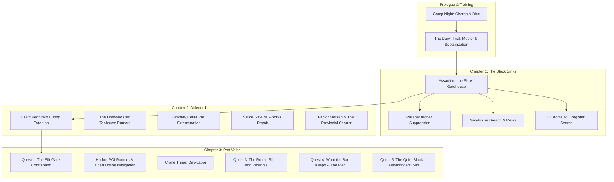

# Quests & Contracts Reference — The Carrion Company

A developer reference for every major quest, side contract, municipal task, and investigation across *A Mercenary's Path*. Keep this updated whenever a new quest, objective stage, or resolution branch is added.

---

## Quest State Architecture & Standards

All quests use standardized ChoiceScript lifecycle variables declared in `startup.txt`:
1. **Stage Flag (`[quest_name]_quest_stage`):**
   - `"unstarted"` — Initial state before the briefing, notice, or trigger event.
   - `"active"` — Accepted / ongoing; unlocks investigation choices, district travel goals, and POI scenes.
   - `"resolved"` — Finished; locks out repeatable investigation branches and updates district ambient prose.
2. **Resolution Flag (`[quest_name]_resolution`):**
   - Stores the narrative path taken (e.g. `"watch_seized"`, `"hush_money"`, `"leverage"`, `"scales_extorted"`).
3. **Intel & Evidence Flags:**
   - Tracks discovered clues, stolen manifests, or extracted names (`[quest_name]_full_intel`, `found_customs_vellum`, etc.).
4. **Reward & Claim Flags:**
   - One-time payout protection (`[quest_name]_bounty_claimed`), reputation boosts (`port_watch_rep`, `gilded_scales_rep`, `black_oath_rep`, `vane_standing`), and unique items (`has_silt_gate_payout_slip`).

---

## Chapter Overview



---

## Chapter 1: The Black Sinks (`battle_black_sinks.txt`)

### 1. Assault on the Sinks Gatehouse
* **Scene File:** `battle_black_sinks.txt`
* **Briefing / Origin:** Captain Vane & squad sergeants prior to the causeway charge.
* **Core Objectives:**
  1. Cross the flooded mud-causeway under missile fire.
  2. Suppress the parapet archers and defensive barricades.
  3. Breach the iron-studded oak gatehouse and break the defending line.
* **Investigation / Sub-Objectives:**
  * **Search the Sinks Toll-House (`bivouac_search`):** Search the water-damaged office to recover the *Grey Waterway Toll Register* vellum (`found_customs_vellum = true`).
  * **Repair with Magic:** Use `[Cantrip: Mending]` to restore the torn vellum and salt-soaked seals.
* **Key Variables:**
  * `found_customs_vellum` (boolean) — Held in pack for leverage in Chapter 2 (Alderford).
  * `customs_register_restored` (boolean) — Repaired via Mending or careful drying.

---

## Chapter 2: Alderford River Hub (`alderford.txt`)

### 1. The Fish-Curing Lofts Extortion
* **Scene File:** `alderford.txt` (`alderford_fish_curing`)
* **Briefing:** River workers cornered by Bailiff Rennick and two iron-cudgel thugs shaking down the drying lofts for illegal toll-tribute.
* **Resolution Paths:**
  1. **Provincial Charter Leverage:** Slam the *Grey Waterway Toll Register* onto the salting bench (`found_customs_vellum`), citing Section 12 to expose Rennick's debt as unsanctioned extortion (Automatic Success).
  2. **Thaumaturgy / Arcane Intimidation:** Booming command with violet flaring lantern light (`CHA DC 10` / Tiefling / Spellcaster).
  3. **Martial Feat of Strength:** Snap a 3-inch oak curing beam barehanded (`STR DC 10` / Fighter / Barbarian).
  4. **Sleight of Hand Disarm:** Slice Rennick's purse-strings and kick his lead guard's knee (`DEX DC 10` / Rogue).
  5. **Physical Combat:** Full squad brawl against Rennick's cudgel-men (`combat.txt`).
* **Rewards:** +10–18 Silver Marks, Alderford worker regard, unlocks Gilded Scales leverage.

### 2. The Granary Cellar Infestation
* **Scene File:** `alderford.txt` (`alderford_granary`)
* **Briefing:** Mill master offers silver to clear aggressive bog-rats nesting beneath grain chutes.
* **Resolution Paths:**
  1. Tactical extermination / rat combat (`combat.txt` — `fight_granary_rats`).
  2. Trapping and barrier construction (`INT DC 11` / `DEX DC 11`).
* **Rewards:** +12 Silver Marks, clean meal rations.

### 3. Factor Morzan & The Provincial Charter
* **Scene File:** `alderford.txt` (`alderford_counting_house`)
* **Briefing:** Deliver the recovered Black Sinks Toll Register to the Gilded Scales counting house.
* **Resolution Paths:**
  1. Turn in the vellum for full guild contract price (+40 Silver Marks, `+2 gilded_scales_rep`).
  2. Leverage the tax skims to secure merchant concessions for the Carrion Company supply train.
* **Variables:** `turned_in_customs_vellum = true`.

---

## Chapter 3: Port Valen Municipal Quests (`port_valen.txt`)

### Quest 1: The Silt-Gate Contraband
* **Scene File:** `port_valen_dredge_end.txt` (`pv_dredge_silt_gates`, `pv_silt_gate_stakeout`, `pv_silt_gate_ambush_watch`, `pv_silt_gate_parley_oath`, `pv_silt_gate_divert_vane`); briefed and reported at `port_valen.txt`'s `pv_quays_voss_briefing`/`pv_quays_voss_report` (Harbor Quayside).
* **District:** Dredge-End (Low drainage flume & tidal vault).
* **Briefing:** Dockmaster Voss reports uninspected highland shear-steel and illicit peat-spiritus entering through the tidal flap-valves during midnight flood tides. He's a customs official, not a Watch officer — he can catch corruption near his docks and escalate it hard, but every consequence he promises routes through "the Watch captain," never his own authority.

#### Objective Flow:
1. **Daytime Recon (`pv_dredge_silt_gates`):**
   * Map roofline blind spots and spot the lantern-boy (`silt_gate_lookout_spotted = true`).
   * Jam the street-level storm-winch counterweight cog (`silt_gate_winch_jammed = true`).
   * Study high-tide charcoal marks on the stone vault.
   * `[Cantrip: Mage Hand]` — Remotely wedge an iron bolt into the winch cog from the canal shadows.
2. **Night Stakeout Prep (`pv_silt_gate_stakeout`):**
   * Wait for night flood tide (`[~2 Hours]`).
   * `[Cantrip: Guidance]` — Divination focus buff (`+1d4` to next check).
   * `[Cantrip: Prestidigitation]` — Snuff the platform's fish-oil lamp from afar (`silt_gate_lamp_snuffed = true` ➔ Advantage on ambush).
   * `[Cantrip: Minor Illusion]` — Project false patrol footsteps down the north cut (`silt_gate_illusion_active = true` ➔ Advantage on ambush).
3. **Three Resolution Branches:**

| Branch | Mechanics & Spells | Outcome & State |
|---|---|---|
| **Branch A: Ambush for the Watch** (`pv_silt_gate_ambush_watch`) | • `[STR DC 12]` / `[DEX DC 12]` / `[INT DC 11]`<br>• `[Cantrip: Shocking Grasp]` (Advantage, `INT DC 11`)<br>• `[Cantrip: Ray of Frost]` (Freeze rudder, `INT DC 11`)<br>• `[Spell: Magic Missile]` (1 Slot, Auto-Success) | Success: neutralizes drop, muscles barrow to Quayside.<br>`silt_gate_resolution = "watch_seized"`<br>+12 Silver bounty from Voss (`+1 port_watch_rep`).<br>**Failure (`pv_silt_gate_ambush_fail`): the drop gets away.** No cargo, no bounty, +2 or +3 fatigue, `black_oath_rep -1`, and `silt_gate_resolution = "failed"`. |
| **Branch B: Parley & Bribe** (`pv_silt_gate_parley_oath`) | • `[CHA DC 12]` / `[WIS DC 11]` / `[INT DC 11]`<br>• `[Cantrip: Thaumaturgy]` (`CHA DC 10`, 30 Silver Marks)<br>• `[Spell: Charm Person]` (1 Slot, 25 Silver Marks)<br>• `[Spell: Disguise Self]` (1 Slot / Hexblood, 25 Silver Marks) | Success: shakes down independent contraband broker for a hush-money cut.<br>`silt_gate_resolution = "hush_money"`<br>+25–30 Silver Marks.<br>**Failure (`pv_silt_gate_parley_fail`): you are walked out with nothing.** No coin (the old 15-silver consolation is gone), `black_oath_rep -1`, `silt_gate_resolution = "failed"`. |
| **Branch C: Squeeze the Payroll** (`pv_silt_gate_divert_vane`) | • `[CHA DC 12]` / `[STR DC 12]` / `[WIS DC 11]`<br>• `[Cantrip: Thaumaturgy]` (`CHA DC 10`)<br>• `[Spell: Dissonant Whispers]` (1 Bard Slot, Auto-Intel) | Pins the broker for the names of the Watch sergeants he pays. The crates are left on the platform; the payout slip is the prize.<br>`silt_gate_resolution = "leverage"`<br>`has_silt_gate_payout_slip = true`<br>`silt_gate_full_intel = true / false` (a failed check costs the second name).<br>**Spend it once:** give it to Voss (`pv_silt_gate_slip_voss`: +8 silver with both names, +6 with one, `+1 port_watch_rep` only with both) **or** take it to Captain Vane (`port_valen_vane_slip_turnin`: `+1 vane_standing`, no coin, sets `vane_watch_leverage`). Or lie to Voss and keep it (`pv_silt_gate_slip_keep`). |

* **Why Branch C is about the names, not the steel:** Vane's briefing asks for leverage and standing ("the Carrion holds the leverage when you wash your fingers"), and never mentions steel or an armory, so the branch no longer invents that goal. The payout slip is the strings he can pull, and it can only be spent once, the same shape as Rotten Rib's waybill.
* **Loss state:** `silt_gate_resolution = "failed"` (from a failed ambush or parley). The dossier shows "The Drop Got Away", the flume revisit says the run is still going, and Voss's report (`pv_quays_voss_report`) closes the matter with no bounty. See `QUEST_DESIGN_RULES.md`, "Failure Must Cost Something".

---

### Quest 3: The Rotten Rib (The Iron Wharves)
* **Scene File:** `port_valen.txt` (`pv_poi_drydock`, `pv_poi_drydock_menu`, `beat_1_*` through `beat_4_*`, `pv_poi_brant_slipway`, `port_valen_vane_timber_turnin`)
* **District:** Harbor Quayside, reached through the Iron Wharves POI (`pv_poi_drydock`). Also touches The Cleaved Keel (rumors) and the Carrion Compound hub (Vane turn-in).
* **Hub shape:** `pv_poi_drydock` pays the 15-minute entry cost once, prints the arrival vignette, and either turns the player away or lands on `pv_poi_drydock_menu`. Every yard exit returns to the menu, never to the arrival label. The menu re-checks the closing hours itself, because quest beats spend time and can carry the player past the shift bell.
* **Operating hours:** open Morning/Midday/Afternoon only. Dusk, Night, Pre-Dawn, and Storm/Blizzard close the gate (no filler choices, straight back to the quayside).
* **Briefing:** no quest-giver singles the player out. An old shipwright on Slipway Two is seen testing his hull with a mallet. The player chooses to step onto the scaffold, and he only explains once asked. A pre-seed rumor at The Cleaved Keel hints at the fines and green timber (`rotten_rib_quest_stage = "unstarted"` only).
* **Names:** the shipwright stays "the old man" in narration until the apprentices name him (Master Brant) and he names himself. Elric and Hendryk reach the player through Brant's dialogue before either appears.
* **Objective Flow:**
  1. **Slipway Two (`beat_1_*`, `beat_2_*`):** observe, question the apprentices, or approach Brant. Accepting the lead sets `rotten_rib_quest_stage = "active"` and hands over the sap-weeping splinter (`has_rotten_rib_splinter`). Declining ("not my fight") closes that conversation without starting the quest.
  2. **Timber Sheds (`beat_3_*`, 15 min):** four routes to the hidden oak behind the boiler shed, all ending at `beat_3_find_stash`:
     * `[WIS DC 11]` follow the drag-scrapes.
     * `[INT DC 11]` read the ledger notes (one attempt per visit).
     * Sawyers: `[CHA DC 12]` / `[STR DC 12]` / `[Spell: Charm Person]` / 2 silver.
     * River-gate: `[DEX DC 11]` (advantage in Fog) or `[Cantrip: Minor Illusion]`.
     * A failed approach sets `elric_alerted` instead of dead-ending. The find sets `has_diverted_timber_waybill`.
  3. **The stash choice:** confront Elric now, report to Brant (advice on how each pressure point works), or slip away with the waybill and come back later.
  4. **Elric's office (`beat_4_*`):** alerted vs. unalerted prose and a different opening bribe (4 vs. 8 silver). Re-entering from the menu costs 10 min (`beat_4_climb`). Walking out before rolling resolves nothing but sets `elric_alerted`. **Failure at the climax costs something real and never converts into the route or reward it was chasing** (see `QUEST_DESIGN_RULES.md`, "Failure Must Cost Something"):
     * **Strikes.** A failed INT, STR or blackmail check gets the player thrown out by Elric's draymen (10 min). That is one strike: `elric_alerted` is set, the DC for the same checks rises from 12 to 13, and the purse stays at 4 silver. A **second strike** ends the quest as `"failed"` (the oak is carted off).
     * **Failed extortion** is not a strike. Elric snatches the waybill and burns it, and the quest ends as `"failed"` immediately. No consolation payout.
     * **Ledger clue.** Reading the chalk initials on the Bay Four pillar sets `rotten_rib_ledger_clue`, which gives advantage on the appeal to Hendryk.
* **Resolutions (three ways to win, one to lose):**

| Branch | How | Outcome & State |
|---|---|---|
| **A: Guild Truth** (`beat_4_branch_a`, `beat_4_hendryk_*`) | Leave the purse and go over Elric's head to Hendryk (30 min). At the factor's door: `[CHA DC 13]` (14 if alerted) hold your ground, or `[INT DC 12]` (13 if alerted) make the case from the waybill. Advantage with `rotten_rib_ledger_clue`. Turning back at the door is free but alerts Elric. | Success: `rotten_rib_resolution = "lawful"`. +4 silver, `gilded_scales_rep +1`, `brant_favor`, Brant's Iron-Heel Boots. Elric arrested, the slipway gets a 3-day grace. **Failure: the waybill and splinter are taken, `gilded_scales_rep -1`, and the quest ends as `"failed"`.** |
| **B: Shakedown** (`beat_4_take_bribe`, `beat_4_branch_b`) | Take the purse (4 or 8 silver, a straight choice), or `[CHA DC 13/10]` extortion for 14 silver. | `rotten_rib_resolution = "shakedown"`. Waybill destroyed, `brant_favor` stays false, the green spruce ships. **A failed extortion pays nothing and ends as `"failed"`.** |
| **C: Silent Leverage** (`beat_4_branch_c`) | `[INT DC 12]` cite charter law, `[STR DC 12]` intimidate, or `[CHA DC 12]` blackmail (DC 13 if alerted) | `rotten_rib_resolution = "blackmail"`. Oak rolled back to Brant, player keeps the waybill, `brant_favor`, Brant's Iron-Heel Boots. A failure is a strike (see above). |
| **Failed** (`beat_4_failed_*`) | Burned waybill, a failed appeal to Hendryk, or a second strike | `rotten_rib_resolution = "failed"`. The ship launches on green wood. **No coin, no gear, no favor from Brant.** The stats sheet shows "The Ship Launched on Green Wood" and the Keel has its own rumor. |

* **Captain Vane hook:** while `rotten_rib_resolution = "blackmail"` and `has_diverted_timber_waybill`, the compound hub offers `port_valen_vane_timber_turnin` (independent operatives only): +5 silver and `vane_standing +1`, once (`vane_timber_turned_in`). The waybill can't be turned in mid-quest.
* **Post-resolution:** with `brant_favor`, `pv_poi_brant_slipway` opens as an allied contact. Its prose branches on `campaign_day - rotten_rib_resolved_day` (ship still on the ways vs. long since launched) and on `rotten_rib_resolution`, so it stays valid on any later day. Without `brant_favor`, the menu still has the crane-watching and sluice-walk beats.
* **Rumor lifecycle:** the pre-seed rumor is only offered while unstarted. After resolution it is replaced by one outcome-specific rumor per branch (`pv_tavern_rumor_rotten_rib_after`).
* **Items:** Brant's Iron-Heel Shipwright Boots (`has_brant_iron_heel_boots`, feet slot id `brant_iron_heel_boots`, cosmetic, no AC); Sap-Weeping Spruce Splinter and Diverted Timber Waybill (evidence, shown in the dossier inventory while held).
* **Variables:** `rotten_rib_quest_stage`, `rotten_rib_resolution`, `rotten_rib_resolved`, `rotten_rib_resolved_day`, `has_rotten_rib_splinter`, `has_diverted_timber_waybill`, `vane_timber_turned_in`, `elric_alerted`, `rotten_rib_strikes`, `rotten_rib_ledger_clue`, `brant_favor`, `has_brant_iron_heel_boots`, `pv_tavern_rumor_rotten_rib`, `pv_tavern_rumor_rotten_rib_after`.

---

### Quest 4: What the Bar Keeps (The Pier)
* **Scene File:** `port_valen.txt` (`pv_poi_pier`, `pv_poi_pier_menu`, `bar_tobin_*`, `bar_go_out`, `bar_r1` through `bar_r3`, `bar_landing`, `bar_route_*`, `bar_strategic_*`, `pv_poi_marl_skiff`)
* **District:** Harbor Quayside, the Pier. Also touches The Cleaved Keel (rumors) and a net-drying loft above the fish-market smokehouses (the strategic route ends there).
* **Hub shape:** `pv_poi_pier` pays the 15-minute entry cost once and prints the arrival vignette, then lands on `pv_poi_pier_menu`. Every pier exit returns to the menu, never to the arrival label. The menu offers the hook (only when it applies), the gallows-frame, the lower ladders, Marl's skiff (strategic route only), and the way back.
* **Bug fixed along the way:** the pier's Dusk branch used to be nested inside its Night branch and could never run. It now runs, with its own storm case.
* **Hook hours:** the watcher only appears at `Night` or `Pre-Dawn`, never in `Storm` or `Blizzard`, and only while `bar_quest_stage = "unstarted"`. The rest of the pier is open at any hour.
* **Briefing:** no quest-giver singles the player out. One of the pier's two watchers stays out on the open stone, pacing with a knotted line in his fist. The player walks up and asks. Tobin's name and the Black Oath are only revealed when asked (`bar_asked_who` sets `codex_black_oath`). The skipper is Marl Coyne and the boy is Pip, both named only in dialogue.
* **Objective Flow:**
  1. **The conversation (`bar_tobin_hub`):** ask what the line on the post is for, who he ties the knots for, and why one knot is still on it (always at least three options until the final commit). Walking away sets `bar_quest_stage = "declined"` and is **permanent**: the survivors are lost off-screen, and the pier and Keel remember it.
  2. **The reef (`bar_r1`, `bar_r2`, `bar_r3`, 20 + 20 + 25 min):** three beats with the bell as the clock.
     * Crossing (`[DEX DC 12]`, `[WIS DC 12]`, `[INT DC 12]`, `[Cantrip: Mage Hand]`, `[Cantrip: Guidance]`). Rain, snow and sleet make the footing hazardous; fog hides the swell. Success sets `bar_ahead` or `bar_line_rigged`; failure sets `bar_rattled`.
     * The wreck (`[STR DC 13]`, `[DEX DC 12]`, `[INT DC 12]`, `[CHA DC 12]`). `bar_rattled` gives disadvantage and `bar_ahead` gives advantage. Any failure loses the casks, never a survivor.
     * Back before the flood: leave the casks, haul them (`[STR DC 13]`), or float them for later (`[INT DC 12]`). `bar_line_rigged` gives advantage on both. If the casks are already lost, this is a short linear passage.
  3. **The landing (`bar_landing_hub`):** three resolutions.
* **Three Resolutions:**

| Route | How | Outcome & State |
|---|---|---|
| **Lawful** (`bar_route_lawful`) | Signal the customs tower for the dockmaster and the Watch | `bar_resolution = "lawful"`. `port_watch_rep +1`, `black_oath_rep -1`. Finder's share 6 silver with the casks, 2 without. Marl is fined and her boat impounded. Tobin flees. |
| **Pragmatic** (`bar_route_pragmatic`) | Let Tobin whistle for the Oath's men | `bar_resolution = "pragmatic"`. `black_oath_rep +1`. 12 silver with the casks, 4 without. In the spooked fallback after a failed strategic persuasion, nothing: no coin and no standing. Marl and Pip go back under the Oath's thumb. |
| **Strategic** (`bar_route_strategic`) | Convince Tobin to report the skiff lost with all hands: `[CHA DC 12]`, `[INT DC 12]`, or 3 silver | `bar_resolution = "strategic"`. `black_oath_rep -1`, `marl_favor`, Marl's Tarred Rope Belt. Marl and Pip are hidden in the smokehouse loft and struck off the roll. A failed persuasion spooks Tobin (`bar_tobin_spooked`), and he hands them over for nothing. |

* **Marl's favor (`marl_favor`):** created and set on the strategic route and **reserved for future sea travel**. Only `pv_poi_marl_skiff` reads it for now (a weather-aware, Dusk/Night/Pre-Dawn contact menu; the "passenger past the harbor chain" line is the promise later content will cash in). No mechanical perk ships with this quest, and the belt is cosmetic.
* **World memory:** the pier's arrival prose changes with the outcome (a Watch lantern and the line gone from the post after the lawful route, the line a knot shorter after the pragmatic one, a cut length of the line hung from the bell's striker after the strategic one that watermen tug for the living, an uncut knot left in the line after a declined rescue). The Keel replaces its pre-seed rumor with one outcome-specific rumor.
* **Operating model (keep consistent):** the Oath's claim is on the water, not on paper. Bribery buys the Watch's blindness for a night (Sergeant Kray, six marks a week, see the Silt-Gate chapter) but never knowledge of who else crossed -- which is exactly why a man stands on the stone. Tobin's line is not a ledger: each knot is a boat still out on their water, and he cuts it out when she is back. Write the faction as watchers, not bookkeepers.
* **Rep note:** lawful -1, pragmatic +1, strategic -1 on `black_oath_rep`. Setbacks here are meant to be recoverable through the radiant faction quests planned for later.
* **Items:** Marl's Tarred Rope Belt (`has_marl_rope_belt`, waist slot id `marl_rope_belt`, cosmetic, no AC).
* **Variables:** `bar_quest_stage`, `bar_resolution`, `bar_resolved`, `bar_resolved_day`, `bar_met_tobin`, `bar_asked_watching`, `bar_asked_who`, `bar_asked_out`, `bar_knows_boy`, `bar_rattled`, `bar_ahead`, `bar_line_rigged`, `bar_cargo_lost`, `bar_cargo_saved`, `bar_tobin_spooked`, `marl_favor`, `has_marl_rope_belt`, `pv_tavern_rumor_bar`, `pv_tavern_rumor_bar_after`.

---

### Quest 5: The Quiet Block (The Fishmongers' Slip)
* **Scene File:** `port_valen.txt` (`pv_poi_fish_slip`, `pv_poi_fish_slip_menu`, `pv_poi_fish_stalls`, `pv_poi_fish_gossip`, `fish_watch`, `fish_block_hub`, `fish_wenna_talk`, `fish_climax_hub`, `fish_route_*`, `fish_lawful_*`, `fish_pragmatic_*`, `fish_strategic_*`). Design and full prose: `quest/FISH_SLIP_PLAN.md`.
* **District:** Harbor Quayside, the Fishmongers' Slip. It replaces the removed Saint Althea shrine stop. Also touches The Cleaved Keel (rumors).
* **Hub shape:** `pv_poi_fish_slip` pays the 15-minute entry cost once, then lands on `pv_poi_fish_slip_menu`. The slip is closed at Dusk, Night, Storm and Blizzard (a short description and a route back, no filler choices). The auction option only appears at Pre-Dawn and Morning.
* **Market:** stalls (instant, coin-limited): fried smelt (3 copper, +1 Temp HP, +1 DEX for 4h), oysters (3 copper, +1 INT for 4h) and a plain pasty (2 copper, no buff). The Keel covers CON, STR, CHA and WIS, so the two together cover every stat. While `fish_slip_shunned` is true, every item costs one copper more. Gossip is free and keyed to the quest state.
* **Briefing:** nobody offers the quest. At the dawn auction the player watches a widow's bass go for half price with no bid, while three buyers signal with two fingers to a cap brim, a scratched ear and a glance at a boot. The player chooses to follow her. Wenna Rusk is named by herself and Thale by Wenna.
* **Objective Flow:**
  1. **The rail (`fish_watch`, 20 min):** the auction, with a state-aware aftermath scene once the quest is resolved or failed.
  2. **The block hub (`fish_block_hub`, free):** talk to the widow (sets `active`), study the buyers' hands once (`[INT DC 11]`: success sets `fish_saw_signals`, failure sets `fish_ring_wary`, and either way `fish_study_tried`), watch more lots, decide, or leave. `[Cantrip: Guidance]` loops back.
  3. **The last lot (`fish_climax_hub`):** three routes, each with one roll that is the climax. `fish_ring_wary` adds +1 DC to every route check and `fish_saw_signals` gives advantage on the INT and WIS options.
* **Resolutions (three ways to win, one to lose):**

| Route | How | Outcome & State |
|---|---|---|
| **Lawful** (`fish_route_lawful`) | The slip-warden's booth: `[INT DC 12]` lay out the pattern, or `[CHA DC 12]` be believed (DC 13 if wary) | `fish_resolution = "lawful"`. `port_watch_rep +1`, 3 silver informant's share, the ring struck off the block for the season. **Failure: `port_watch_rep -1`, `fish_slip_shunned`, quest `"failed"`.** |
| **Pragmatic** (`fish_route_pragmatic`) | Buy into the ring: `[CHA DC 12]` play a buyer's agent, or `[WIS DC 12]` answer the signals (advantage with `fish_saw_signals`) | `fish_resolution = "pragmatic"`. 5 silver from the common purse, no standing change, the widow stops speaking to you. **Failure: `fish_slip_shunned`, no coin, quest `"failed"`.** |
| **Strategic** (`fish_route_strategic`) | Needs 4 silver visible in your purse (`*selectable_if`). Bid against the ring: `[WIS DC 12]`, `[INT DC 12]` (advantage with signals) or `[Cantrip: Minor Illusion]` | `fish_resolution = "strategic"`. No coin changes hands (the stake becomes the widow's price and a cook-house runner buys the lot at what you paid), `wenna_favor`, the ring is broken. **Failure: the 4-silver stake is forfeited and the quest is `"failed"`.** |

* **Loss state:** `fish_quest_stage = "failed"`, `fish_resolution = "failed"`. The dossier shows "The Quiet Block (the ring held)", gossip and the Keel have their own failed lines, and lawful or pragmatic failure raises stall prices.
* **Wenna's favor (`wenna_favor`):** created and set on the strategic route and **reserved for future wholesale dealing at the slip**. Only the stall prose reads it for now.
* **World memory:** the auction scene changes with the outcome (new buyers bidding hard after the lawful route, the same quiet half circle after the pragmatic route or a failure, honest bidding after the strategic route).
* **Items:** none.
* **Variables:** `pv_slip_seen`, `fish_quest_stage`, `fish_resolution`, `fish_resolved`, `fish_resolved_day`, `fish_met_wenna`, `fish_study_tried`, `fish_saw_signals`, `fish_ring_wary`, `fish_slip_shunned`, `wenna_favor`, `pv_tavern_rumor_fish`, `pv_tavern_rumor_fish_after`.

---

### Crane Three: Dell Ostrey's Day-Labor
* **Scene File:** `port_valen.txt` (`pv_poi_crane`, `pv_crane_menu`, `pv_crane_offer`, `pv_crane_shift_intro`, `pv_crane_shift_resolve`)
* **District:** Harbor Quayside (`pv_poi_quays`, crane three on the cargo line).
* **Design intent:** a repeatable, ungated day-labor job, not a bounty — the down-to-earth counterpart to the district's bigger municipal contracts. See `QUEST_DESIGN_RULES.md` §6 ("Minor / Street Tasks") for the scaling this stays inside.
* **Origin:** pays off a line Dockmaster Voss already speaks at `pv_quays_voss_briefing` — "talk to the gang-boss by crane three" — rather than a new quest-giver. Only reachable during daytime/dusk hours (the quay gate is shut Night/Pre-Dawn, per existing `pv_poi_quays` canon).
* **Briefing:** gang-boss Dell Ostrey is two hands short of a contracted hold-clearing before the evening bell — one docker laid up from a crane accident, three more boycotting the hull over a wage dispute with its mate. He hires the player as an outside hand exempt from the dock crews' turf and solidarity norms.
* **First-Shift Resolution (`pv_crane_shift_intro`):** one archetype choice fully resolves the shift, each with its own fail-forward (not a dead end):
  * **STR** (`Athletics DC 12`) — brute-force pace; failure still clears the hold on time but costs 2 HP.
  * **DEX** (`Acrobatics DC 12`) — work the crane's guy-lines; failure damages a crate (bonus lost, base pay kept).
  * **INT** (`Investigation DC 11`) — re-sequence the lift order off the chalk-board; failure runs the shift late (bonus lost).
  * **CHA** (`Persuasion DC 11`) — talk the ship's mate into a grace window before lifting anything; failure wastes the time and the shift still runs late.
* **Economics:** flat 4 silver marks (40 copper, "a copper a crate") base pay regardless of outcome, plus a 3-silver on-time/undamaged bonus that can be haggled to 4 silver at the offer (`CHA DC 11`, `crane_fee_bonus`) — the haggled rate persists to every future shift.
* **The repeatable loop:** once the first shift resolves, `crane_job_unlocked` opens ordinary day-labor at crane three — same archetype choice, same pay math, gated to one shift per `campaign_day` (`crane_last_shift_day`). No faction reputation changes; this is wage labor, not a municipal contract.
* **Future work (not yet implemented):** `crane_shifts_completed` and `crane_dell_regard` are tracked from the first shift onward specifically so a later promotion ladder (better rate, standing crew role, etc.) has something to read.
* **Variables:** `crane_quest_stage`, `crane_seen`, `crane_grievance_known`, `crane_fee_bonus`, `crane_first_shift_method`, `crane_shift_ontime`, `crane_shift_damaged`, `crane_job_unlocked`, `crane_shifts_completed`, `crane_last_shift_day`, `crane_dell_regard`, `crane_award_locked`, `locked_crane_award_page_id`.

---

## Harbor POIs & Minor Contract Log

| Location | Quest / Activity | Requirements / Triggers | Rewards |
|---|---|---|---|
| **The Cleaved Keel Taphouse** | Tavern Dice Gambling & Port Valen Rumors | Open after Vane briefing (`pv_pois_open`) | Up to 15 Silver Marks, 3 unique district rumors |
| **Fishmongers' Slip** | **The Quiet Block** (see Quest 5 and `quest/FISH_SLIP_PLAN.md`): a dawn auction where a ring of buyers never bids against each other. Plus DEX/INT street food and gossip | Open Pre-Dawn to Afternoon; closed Dusk, Night, Storm and Blizzard; the auction is Pre-Dawn and Morning only | Up to 5 Silver Marks, or `port_watch_rep +1` and 3 Silver, or an ally (`wenna_favor`); failure costs stall prices and Watch standing |
| **Sail-Loft Ropes** | Rigging repairs, tarred hemp cordage, climbing gear | Open during daytime hours | Rigging tools for Sapper / Rogue checks |
| **Harbor Chart House** | Tidal charts, channel navigation, barge clearance (deferred: planned for the customs area, not its own Quayside stop) | Requires `port_watch_rep >= 1` or `gilded_scales_rep >= 1` | Tidal navigation advantages |
| **Iron Wharves** | The Rotten Rib investigation; allied contact on Slipway Two afterward | Daytime, fair weather only (gate closed at Dusk/Night/Pre-Dawn and in Storm/Blizzard) | Up to 14 Silver Marks, Brant's Iron-Heel Boots, `gilded_scales_rep +1` |
| **The Pier** | What the Bar Keeps night rescue; Marl's skiff contact afterward (strategic route) | Hook only at Night/Pre-Dawn in fair weather; the rest of the pier is always open | Up to 12 Silver Marks, or a permanent ally and Marl's Tarred Rope Belt |
| **Crane Three** | Repeatable dock day-labor for gang-boss Dell Ostrey | Daytime/Dusk only; first shift resolves a one-off headcount crisis | 4 Silver Marks base + up to 4 Silver Marks bonus per shift, once/day |

> **Removed:** the Tide-Well / Saint Althea shrine stop (it had no mechanics and the Alderford chapel and a planned city cathedral cover the same ground). Its two ambient hub lines stay as scenery. The pier quest's strategic ending now hides Marl and Pip in a net-drying loft above the fish-market smokehouses.

### World Economy Layers (design note for the future trading simulator)

* **Quayside (physical layer):** warehouses, cranes, the fish market and the Fishmongers' Slip. Small lots, day wages, commoner trade.
* **Civic Heights (paper layer):** the Gilded Scales head house beside the Council Hall: banking and letters of credit, entry writs for the Patrician Quarter, dispatches, and the (later) contracts window. Alderford's counting house and Hendryk's factor's office at the Iron Wharves are branches of this. The **Patrician Quarter** is the merchant lords' private enclave (great houses, walled estates, the Terrace Walk, a tailor), reached by a Day Writ or Registered Writ bought at the head house.
* **The Pier (sea layer):** hulls, skiffs and later sea travel. `marl_favor` is reserved for it.
* **`wenna_favor`** (from The Quiet Block, strategic route) is reserved for wholesale dealing at the Slip.
* **Governance:** Port Valen is a **free city** (a status, not a name: it comes from an old Meridian charter, and other free cities can exist with their own governments; the carved legend reads "The Free City of Port Valen"), ruled by its Council (the Council of Factors, drawn from the senior merchant houses of the Gilded Scales). It is a plutocracy in practice, and the game never uses that word: the player sees it in the two tax-hall lines and the carved legend over the Council Hall, and the codex says "whoever controls the purse controls the city." The Free City's reach extends to the surrounding towns and villages of the river country, Alderford among them, through tolls, tax contracts and factors rather than garrisons. Old imperial charters (free-wharf exemptions, church toll immunity) are what the independents cite against it. Civic Heights is the seat of the Council, courts, tax and records offices and the Watch headquarters.

---

## Complete Variables Index

```choicescript
*create silt_gate_quest_stage "unstarted"     *comment "unstarted", "active", "resolved"
*create silt_gate_resolution "none"           *comment "watch_seized", "hush_money", "leverage", "failed"
*create silt_gate_lookout_spotted false       *comment daytime recon reward
*create silt_gate_winch_jammed false          *comment daytime recon reward / mage hand
*create silt_gate_recon_done false            *comment tracks daytime scout completion
*create silt_gate_lamp_snuffed false          *comment prestidigitation stakeout buff
*create silt_gate_illusion_active false       *comment minor illusion stakeout buff
*create silt_gate_full_intel false            *comment both corrupt watch names discovered
*create silt_gate_bounty_claimed false        *comment one-time 20 silver watch payout guard
*create has_silt_gate_payout_slip false       *comment the broker's list of paid Watch sergeants (Branch C); spent at Voss or held for Vane
*create vane_watch_leverage false             *comment Vane holds the names; RESERVED for future radiant Watch quests
*create port_watch_rep 0                      *comment municipal guard standing
*create black_oath_rep 0                     *comment canal smuggling network standing
*create gilded_scales_rep 0                   *comment merchant guild monopoly standing
*create vane_standing 0                       *comment mercenary company captain regard

*comment --- Crane Three day-labor (see full label list above) ---
*create crane_quest_stage "unstarted"         *comment "unstarted", "active", "resolved"
*create crane_seen false                      *comment first-visit intro guard
*create crane_grievance_known false           *comment heard the boycotting dockers' side
*create crane_fee_bonus 3                     *comment 3 or 4 silver -- haggled once, persists every shift
*create crane_first_shift_method "none"       *comment "muscle", "rigging", "tally", "talked"
*create crane_shift_ontime false              *comment recomputed every shift
*create crane_shift_damaged false             *comment recomputed every shift
*create crane_job_unlocked false              *comment true once the repeatable loop is open
*create crane_shifts_completed 0              *comment lifetime counter -- future promotion ladder hook
*create crane_last_shift_day 0                *comment campaign_day of last shift -- one shift/day
*create crane_dell_regard 0                   *comment Dell's opinion -- future promotion gate

*comment --- The Rotten Rib / Iron Wharves (see Quest 3 above) ---
*create rotten_rib_quest_stage "unstarted"    *comment "unstarted", "active", "resolved"
*create rotten_rib_resolution "none"          *comment "none", "lawful", "shakedown", "blackmail", "failed"
*create rotten_rib_resolved false             *comment one-time completion guard
*create rotten_rib_resolved_day 0             *comment campaign_day of resolution -- drives Slipway Two prose
*create has_rotten_rib_splinter false         *comment physical proof from Brant, cleared on resolution
*create has_diverted_timber_waybill false     *comment Hendryk-stamped waybill; kept only on the blackmail route
*create vane_timber_turned_in false           *comment waybill delivered to Captain Vane
*create elric_alerted false                   *comment a failed approach or walk-away raised the alarm
*create rotten_rib_strikes 0                  *comment failed INT/STR/blackmail checks at Elric; the second ends the quest
*create rotten_rib_ledger_clue false          *comment read the Bay Four initials; advantage when appealing to Hendryk
*create brant_favor false                     *comment unlocks the Slipway Two contact (lawful and blackmail only)
*create has_brant_iron_heel_boots false       *comment reward footwear
*create pv_tavern_rumor_rotten_rib false      *comment Cleaved Keel pre-seed rumor
*create pv_tavern_rumor_rotten_rib_after false *comment Cleaved Keel post-resolution rumor

*comment --- What the Bar Keeps / The Pier (see Quest 4 above) ---
*create bar_quest_stage "unstarted"           *comment "unstarted", "active", "resolved", "declined" (declined is permanent)
*create bar_resolution "none"                 *comment "none", "lawful", "pragmatic", "strategic"
*create bar_resolved false                    *comment one-time completion guard
*create bar_resolved_day 0                    *comment campaign_day of resolution
*create bar_met_tobin false                   *comment Tobin gave his name and named the Black Oath
*create bar_asked_watching false               *comment conversation hub: asked what the line is for
*create bar_asked_who false                   *comment conversation hub: asked who he counts for
*create bar_asked_out false                   *comment conversation hub: learned which boat is out
*create bar_knows_boy false                   *comment learned a boy is aboard
*create bar_rattled false                     *comment failed crossing -> disadvantage at the wreck
*create bar_ahead false                       *comment clean crossing -> advantage at the wreck
*create bar_line_rigged false                 *comment line across the gully -> advantage hauling back
*create bar_cargo_lost false                  *comment failed at the wreck -> casks lost
*create bar_cargo_saved false                 *comment casks hauled or floated back
*create bar_tobin_spooked false               *comment failed persuasion -> pragmatic route at half pay
*create marl_favor false                      *comment strategic route; RESERVED for future sea travel
*create has_marl_rope_belt false              *comment reward waist item
*create pv_tavern_rumor_bar false             *comment Cleaved Keel pre-seed rumor
*create pv_tavern_rumor_bar_after false       *comment Cleaved Keel post-resolution rumor
*create pv_slip_seen false                     *comment first-visit intro at the Fishmongers' Slip
*create fish_quest_stage "unstarted"           *comment "unstarted", "active", "resolved", "failed"
*create fish_resolution "none"                 *comment "lawful", "pragmatic", "strategic", "failed"
*create fish_resolved false
*create fish_resolved_day 0
*create fish_met_wenna false
*create fish_study_tried false                 *comment one-time INT DC 11 study of the buyers' hands
*create fish_saw_signals false                 *comment study success: advantage on route checks
*create fish_ring_wary false                   *comment study failure: +1 DC on every route check
*create fish_slip_shunned false                *comment failed lawful/pragmatic route: stalls charge +1 copper
*create wenna_favor false                      *comment strategic route; RESERVED for future wholesale dealing
*create pv_tavern_rumor_fish false             *comment Cleaved Keel pre-seed rumor
*create pv_tavern_rumor_fish_after false       *comment Cleaved Keel post-resolution rumor
```
