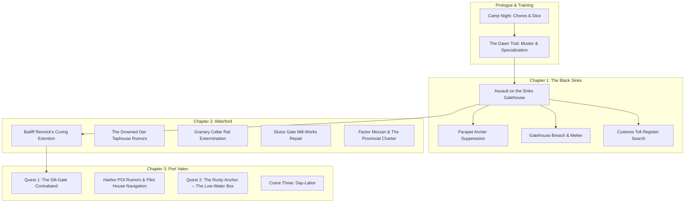

# Quests & Contracts Reference — The Carrion Company

A developer reference for every major quest, side contract, municipal task, and investigation across *A Mercenary's Path*. Keep this updated whenever a new quest, objective stage, or resolution branch is added.

---

## Quest State Architecture & Standards

All quests use standardized ChoiceScript lifecycle variables declared in `startup.txt`:
1. **Stage Flag (`[quest_name]_quest_stage`):**
   - `"unstarted"` — Initial state before the briefing, notice, or trigger event.
   - `"active"` — Accepted / ongoing; unlocks investigation choices, district travel goals, and POI scenes.
   - `"resolved"` — Finished; locks out repeatable investigation branches and updates district ambient prose.
2. **Resolution Flag (`[quest_name]_resolution`):**
   - Stores the narrative path taken (e.g. `"watch_seized"`, `"tally_bribed"`, `"vane_diverted"`, `"scales_extorted"`).
3. **Intel & Evidence Flags:**
   - Tracks discovered clues, stolen manifests, or extracted names (`[quest_name]_full_intel`, `found_customs_vellum`, etc.).
4. **Reward & Claim Flags:**
   - One-time payout protection (`[quest_name]_bounty_claimed`), reputation boosts (`port_watch_rep`, `gilded_scales_rep`, `black_tally_rep`, `vane_standing`), and unique items (`has_silt_gate_iron`).

---

## Chapter Overview



---

## Chapter 1: The Black Sinks (`battle_black_sinks.txt`)

### 1. Assault on the Sinks Gatehouse
* **Scene File:** `battle_black_sinks.txt`
* **Briefing / Origin:** Captain Vane & squad sergeants prior to the causeway charge.
* **Core Objectives:**
  1. Cross the flooded mud-causeway under missile fire.
  2. Suppress the parapet archers and defensive barricades.
  3. Breach the iron-studded oak gatehouse and break the defending line.
* **Investigation / Sub-Objectives:**
  * **Search the Sinks Toll-House (`bivouac_search`):** Search the water-damaged office to recover the *Grey Waterway Toll Register* vellum (`found_customs_vellum = true`).
  * **Repair with Magic:** Use `[Cantrip: Mending]` to restore the torn vellum and salt-soaked seals.
* **Key Variables:**
  * `found_customs_vellum` (boolean) — Held in pack for leverage in Chapter 2 (Alderford).
  * `customs_register_restored` (boolean) — Repaired via Mending or careful drying.

---

## Chapter 2: Alderford River Hub (`alderford.txt`)

### 1. The Fish-Curing Lofts Extortion
* **Scene File:** `alderford.txt` (`alderford_fish_curing`)
* **Briefing:** River workers cornered by Bailiff Rennick and two iron-cudgel thugs shaking down the drying lofts for illegal toll-tribute.
* **Resolution Paths:**
  1. **Provincial Charter Leverage:** Slam the *Grey Waterway Toll Register* onto the salting bench (`found_customs_vellum`), citing Section 12 to expose Rennick's debt as unsanctioned extortion (Automatic Success).
  2. **Thaumaturgy / Arcane Intimidation:** Booming command with violet flaring lantern light (`CHA DC 10` / Tiefling / Spellcaster).
  3. **Martial Feat of Strength:** Snap a 3-inch oak curing beam barehanded (`STR DC 10` / Fighter / Barbarian).
  4. **Sleight of Hand Disarm:** Slice Rennick's purse-strings and kick his lead guard's knee (`DEX DC 10` / Rogue).
  5. **Physical Combat:** Full squad brawl against Rennick's cudgel-men (`combat.txt`).
* **Rewards:** +10–18 Silver Marks, Alderford worker regard, unlocks Gilded Scales leverage.

### 2. The Granary Cellar Infestation
* **Scene File:** `alderford.txt` (`alderford_granary`)
* **Briefing:** Mill master offers silver to clear aggressive bog-rats nesting beneath grain chutes.
* **Resolution Paths:**
  1. Tactical extermination / rat combat (`combat.txt` — `fight_granary_rats`).
  2. Trapping and barrier construction (`INT DC 11` / `DEX DC 11`).
* **Rewards:** +12 Silver Marks, clean meal rations.

### 3. Factor Morzan & The Provincial Charter
* **Scene File:** `alderford.txt` (`alderford_counting_house`)
* **Briefing:** Deliver the recovered Black Sinks Toll Register to the Gilded Scales counting house.
* **Resolution Paths:**
  1. Turn in the vellum for full guild contract price (+40 Silver Marks, `+2 gilded_scales_rep`).
  2. Leverage the tax skims to secure merchant concessions for the Carrion Company supply train.
* **Variables:** `turned_in_customs_vellum = true`.

---

## Chapter 3: Port Valen Municipal Quests (`port_valen.txt`)

### Quest 1: The Silt-Gate Contraband
* **Scene File:** `port_valen_dredge_end.txt` (`pv_dredge_silt_gates`, `pv_silt_gate_stakeout`, `pv_silt_gate_ambush_watch`, `pv_silt_gate_parley_tally`, `pv_silt_gate_divert_vane`); briefed and reported at `port_valen.txt`'s `pv_quays_voss_briefing`/`pv_quays_voss_report` (Harbor Quayside).
* **District:** Dredge-End (Low drainage flume & tidal vault).
* **Briefing:** Dockmaster Voss reports uninspected highland shear-steel and illicit peat-spiritus entering through the tidal flap-valves during midnight flood tides. He's a customs official, not a Watch officer — he can catch corruption near his docks and escalate it hard, but every consequence he promises routes through "the Watch captain," never his own authority.

#### Objective Flow:
1. **Daytime Recon (`pv_dredge_silt_gates`):**
   * Map roofline blind spots and spot the lantern-boy (`silt_gate_lookout_spotted = true`).
   * Jam the street-level storm-winch counterweight cog (`silt_gate_winch_jammed = true`).
   * Study high-tide charcoal marks on the stone vault.
   * `[Cantrip: Mage Hand]` — Remotely wedge an iron bolt into the winch cog from the canal shadows.
2. **Night Stakeout Prep (`pv_silt_gate_stakeout`):**
   * Wait for night flood tide (`[~2 Hours]`).
   * `[Cantrip: Guidance]` — Divination focus buff (`+1d4` to next check).
   * `[Cantrip: Prestidigitation]` — Snuff the platform's fish-oil lamp from afar (`silt_gate_lamp_snuffed = true` ➔ Advantage on ambush).
   * `[Cantrip: Minor Illusion]` — Project false patrol footsteps down the north cut (`silt_gate_illusion_active = true` ➔ Advantage on ambush).
3. **Three Resolution Branches:**

| Branch | Mechanics & Spells | Outcome & State |
|---|---|---|
| **Branch A: Ambush for the Watch** (`pv_silt_gate_ambush_watch`) | • `[STR DC 12]` / `[DEX DC 12]` / `[INT DC 11]`<br>• `[Cantrip: Shocking Grasp]` (Advantage, `INT DC 11`)<br>• `[Cantrip: Ray of Frost]` (Freeze rudder, `INT DC 11`)<br>• `[Spell: Magic Missile]` (1 Slot, Auto-Success) | Neutralizes drop, muscles barrow to Quayside.<br>`silt_gate_resolution = "watch_seized"`<br>+12 Silver bounty from Voss (`+1 port_watch_rep`). |
| **Branch B: Parley & Bribe** (`pv_silt_gate_parley_tally`) | • `[CHA DC 12]` / `[WIS DC 11]` / `[INT DC 11]`<br>• `[Cantrip: Thaumaturgy]` (`CHA DC 10`, 30 Silver Marks)<br>• `[Spell: Charm Person]` (1 Slot, 25 Silver Marks)<br>• `[Spell: Disguise Self]` (1 Slot / Hexblood, 25 Silver Marks) | Shakes down independent contraband broker for hush-money cut.<br>`silt_gate_resolution = "tally_bribed"`<br>+15–30 Silver Marks. |
| **Branch C: Divert to Armory** (`pv_silt_gate_divert_vane`) | • `[CHA DC 12]` / `[STR DC 12]` / `[WIS DC 11]`<br>• `[Cantrip: Thaumaturgy]` (`CHA DC 10`)<br>• `[Spell: Dissonant Whispers]` (1 Bard Slot, Auto-Intel) | Interrogates broker for corrupt Watch names, stashes 50 lbs highland tool-steel in vault.<br>`silt_gate_resolution = "vane_diverted"`<br>`has_silt_gate_iron = true`<br>`silt_gate_full_intel = true / false`<br>`+1 vane_standing`, `+1 port_watch_rep` (+6–8 Silver & `+1 port_watch_rep` on Voss report). |

---

### Quest 2: The Rusty Anchor — The Low-Water Box
* **Scene File:** `port_valen.txt` (`pv_poi_rusty_anchor`, `pv_anchor_hub`, `pv_anchor_low_water`, `pv_anchor_bilge`, `pv_anchor_the_box`, `pv_anchor_choice`, `pv_anchor_aftermath`)
* **District:** Dredge-End (reached from `port_valen_dredge_end`'s own `*choice`, alongside the Silt-Gate flume).
* **Design doc:** `quest/RUSTY_ANCHOR_PLAN.md` — full rationale, the scrapped-draft postmortem, and the rescale-and-review history.
* **Briefing:** taphouse-keeper Big Sal hires the player, on sight, to pull an iron-banded box out of a flooded barge void before the harbor-master's Forgeday lien stamp exposes it to inspection. She undersells the job and lies about the contents — catchable with a `[WIS DC 12]` Insight check at the offer, or buyable outright for an extra silver mark at the haggle.
* **Objective Flow:**
  1. **The hub (`pv_anchor_hub`):** a living taproom — rationed stew tab and a private loft, both gated behind actually earning Sal's trust (see Resolution below), taproom rumors, and the job hook.
  2. **The descent (`pv_anchor_bilge`):** wait for the ebb or go in early (a real risk/reward tradeoff — rising water vs. a chalk-marked hatch the Tally's sounding-man will return to). Five approaches at full archetype parity: `[STR DC 13]` force it, `[DEX DC 13]` thread it, `[INT DC 13]` read the hull first, `[CHA DC 13]` talk the sounding-man into holding the line, plus `[Cantrip: Mage Hand]`/`[Cantrip: Light]`/`[Cantrip: Thaumaturgy]` alternatives. Every failure fails forward — the box goes into the silt, not the player.
  3. **The reveal (`pv_anchor_the_box`):** three layers — Sal's lie, the district's actual debt paper (built from households already seeded in Dredge-End's own ambient prose), and a note of hand proving the Tally collector extorting the district is secretly in debt to the woman he collects from.
* **Five Resolutions (`pv_anchor_choice`):**

| Route | Coin | Standing | What it costs |
|---|---|---|---|
| Give it back to Sal | 2–3 silver (job fee) | — | Unlocks the tab and a private loft (a real `resolve_sleep` sleep-quality tier); the racket continues |
| Carry it to Voss | 4 silver | `port_watch_rep +2`, `black_tally_rep -1` | Sal knows the player sold her to the city |
| Sell to the Scales | 8 silver | `gilded_scales_rep +2`, `black_tally_rep -1` | Dredge-End's debt gets quietly consolidated |
| Keep it | none | `black_tally_rep +1` | The player becomes the district's new paper-holder |
| Burn the ledger | 2–3 silver | `black_tally_rep -2` | Sal is ruined; the debtors go genuinely free |

* **Cross-quest hook:** if the player shook down the Silt-Gate contraband broker via the CHA threat branch in `pv_silt_gate_parley_tally` (`anchor_broker_note = true`), a fresh note on the player's own name turns up in the box — Layer 2 gets personal.
* **Variables:** `anchor_quest_stage`, `anchor_quest_resolved`, `anchor_route`, `anchor_cellar_read`, `anchor_lie_caught`, `anchor_sal_trust`, `anchor_descent`, `anchor_descent_failed`, `anchor_sounding_man`, `anchor_tab_unlocked`, `anchor_fee_paid`, `anchor_broker_note`, `anchor_fee`, `anchor_ebb_ready`, `anchor_watch_chit_recognized`, `anchor_knows_riker_note`, `anchor_knows_second_void`, `anchor_rumor_1`, `anchor_rumor_2`, `anchor_tally_grudge`, `anchor_deposit`, `anchor_stew_used`, `anchor_stew_week_start_day`, `anchor_stew_cap`.

---

### Crane Three: Dell Ostrey's Day-Labor
* **Scene File:** `port_valen.txt` (`pv_poi_crane`, `pv_crane_menu`, `pv_crane_offer`, `pv_crane_shift_intro`, `pv_crane_shift_resolve`)
* **District:** Harbor Quayside (`pv_poi_quays`, crane three on the cargo line).
* **Design intent:** a repeatable, ungated day-labor job, not a bounty — the down-to-earth counterpart to the district's bigger municipal contracts. See `QUEST_DESIGN_RULES.md` §6 ("Minor / Street Tasks") for the scaling this stays inside.
* **Origin:** pays off a line Dockmaster Voss already speaks at `pv_quays_voss_briefing` — "talk to the gang-boss by crane three" — rather than a new quest-giver. Only reachable during daytime/dusk hours (the quay gate is shut Night/Pre-Dawn, per existing `pv_poi_quays` canon).
* **Briefing:** gang-boss Dell Ostrey is two hands short of a contracted hold-clearing before the evening bell — one docker laid up from a crane accident, three more boycotting the hull over a wage dispute with its mate. He hires the player as an outside hand exempt from the dock crews' turf and solidarity norms.
* **First-Shift Resolution (`pv_crane_shift_intro`):** one archetype choice fully resolves the shift, each with its own fail-forward (not a dead end):
  * **STR** (`Athletics DC 12`) — brute-force pace; failure still clears the hold on time but costs 2 HP.
  * **DEX** (`Acrobatics DC 12`) — work the crane's guy-lines; failure damages a crate (bonus lost, base pay kept).
  * **INT** (`Investigation DC 11`) — re-sequence the lift order off the tally-board; failure runs the shift late (bonus lost).
  * **CHA** (`Persuasion DC 11`) — talk the ship's mate into a grace window before lifting anything; failure wastes the time and the shift still runs late.
* **Economics:** flat 4 silver marks (40 copper, "a copper a crate") base pay regardless of outcome, plus a 3-silver on-time/undamaged bonus that can be haggled to 4 silver at the offer (`CHA DC 11`, `crane_fee_bonus`) — the haggled rate persists to every future shift.
* **The repeatable loop:** once the first shift resolves, `crane_job_unlocked` opens ordinary day-labor at crane three — same archetype choice, same pay math, gated to one shift per `campaign_day` (`crane_last_shift_day`). No faction reputation changes; this is wage labor, not a municipal contract.
* **Future work (not yet implemented):** `crane_shifts_completed` and `crane_dell_regard` are tracked from the first shift onward specifically so a later promotion ladder (better rate, standing crew role, etc.) has something to read.
* **Variables:** `crane_quest_stage`, `crane_seen`, `crane_grievance_known`, `crane_fee_bonus`, `crane_first_shift_method`, `crane_shift_ontime`, `crane_shift_damaged`, `crane_job_unlocked`, `crane_shifts_completed`, `crane_last_shift_day`, `crane_dell_regard`, `crane_award_locked`, `locked_crane_award_page_id`.

---

## Harbor POIs & Minor Contract Log

| Location | Quest / Activity | Requirements / Triggers | Rewards |
|---|---|---|---|
| **The Cleaved Keel Taphouse** | Tavern Dice Gambling & Port Valen Rumors | Open after Vane briefing (`pv_pois_open`) | Up to 15 Silver Marks, 3 unique district rumors |
| **Fishmongers' Slip** | Eel & Smoked Fish Rations, High-Flood Gossip | Day-dependent street life | Rations (reduces hunger neglect) |
| **Sail-Loft Ropes** | Rigging repairs, tarred hemp cordage, climbing gear | Open during daytime hours | Rigging tools for Sapper / Rogue checks |
| **Harbor Pilot House** | Tidal charts, channel navigation, barge clearance | Requires `port_watch_rep >= 1` or `gilded_scales_rep >= 1` | Tidal navigation advantages |
| **Tide-Well Shrine** | Tallow candle offerings, sea-priest blessings | Open all hours | Moral focus / Guidance blessings |
| **Crane Three** | Repeatable dock day-labor for gang-boss Dell Ostrey | Daytime/Dusk only; first shift resolves a one-off headcount crisis | 4 Silver Marks base + up to 4 Silver Marks bonus per shift, once/day |

---

## Complete Variables Index

```choicescript
*create silt_gate_quest_stage "unstarted"     *comment "unstarted", "active", "resolved"
*create silt_gate_resolution "none"           *comment "watch_seized", "tally_bribed", "vane_diverted"
*create silt_gate_lookout_spotted false       *comment daytime recon reward
*create silt_gate_winch_jammed false          *comment daytime recon reward / mage hand
*create silt_gate_recon_done false            *comment tracks daytime scout completion
*create silt_gate_lamp_snuffed false          *comment prestidigitation stakeout buff
*create silt_gate_illusion_active false       *comment minor illusion stakeout buff
*create silt_gate_full_intel false            *comment both corrupt watch names discovered
*create silt_gate_bounty_claimed false        *comment one-time 20 silver watch payout guard
*create has_silt_gate_iron false              *comment tool-steel secured for company forge
*create port_watch_rep 0                      *comment municipal guard standing
*create black_tally_rep 0                     *comment canal smuggling network standing
*create gilded_scales_rep 0                   *comment merchant guild monopoly standing
*create vane_standing 0                       *comment mercenary company captain regard

*comment --- Crane Three day-labor (see full label list above) ---
*create crane_quest_stage "unstarted"         *comment "unstarted", "active", "resolved"
*create crane_seen false                      *comment first-visit intro guard
*create crane_grievance_known false           *comment heard the boycotting dockers' side
*create crane_fee_bonus 3                     *comment 3 or 4 silver -- haggled once, persists every shift
*create crane_first_shift_method "none"       *comment "muscle", "rigging", "tally", "talked"
*create crane_shift_ontime false              *comment recomputed every shift
*create crane_shift_damaged false             *comment recomputed every shift
*create crane_job_unlocked false              *comment true once the repeatable loop is open
*create crane_shifts_completed 0              *comment lifetime counter -- future promotion ladder hook
*create crane_last_shift_day 0                *comment campaign_day of last shift -- one shift/day
*create crane_dell_regard 0                   *comment Dell's opinion -- future promotion gate

*comment --- The Rusty Anchor / The Low-Water Box (see quest/RUSTY_ANCHOR_PLAN.md) ---
*create anchor_quest_stage "unstarted"        *comment "unstarted", "offered", "active", "resolved", "declined"
*create anchor_quest_resolved false           *comment one-time completion guard for the aftermath rep swings
*create anchor_route "none"                   *comment "none", "sal", "watch", "scales", "kept", "burned", "walked"
*create anchor_cellar_read "none"             *comment "none", "sounding_line" -- first-visit-seen guard
*create anchor_lie_caught false               *comment WIS Insight catch in pv_anchor_low_water
*create anchor_sal_trust 0                    *comment 0-2 -- tracked, not yet read anywhere
*create anchor_descent "none"                 *comment "none", "forced", "threaded", "surveyed", "talked", "arcaned"
*create anchor_descent_failed false           *comment the box went into the silt on a botched first attempt
*create anchor_sounding_man "none"            *comment "none", "recruited", "dropped", "warned"
*create anchor_tab_unlocked false             *comment Sal's tab and loft -- only the "sal" route grants this
*create anchor_fee_paid false                 *comment the 2/3 silver job fee was actually paid out
*create anchor_broker_note false              *comment set by the silt-gate broker shakedown if taken
*create anchor_fee 2                          *comment 2 or 3 -- set at the offer or the haggle
*create anchor_ebb_ready false                *comment waited for low water vs. went in early
*create anchor_watch_chit_recognized false    *comment gated on silt_gate_full_intel, never asserted
*create anchor_knows_riker_note false         *comment found Layer 3, Riker's note
*create anchor_knows_second_void false        *comment read the sprung stern before stepping on it
*create anchor_rumor_1 false                  *comment one-shot taproom rumours
*create anchor_rumor_2 false
*create anchor_tally_grudge false             *comment the district remembers what the player did
*create anchor_deposit 0                      *comment referenced in Sal's dialogue, no deposit UI yet
*create anchor_stew_used 0                    *comment free tab -- rationed, mirrors the compound mess
*create anchor_stew_week_start_day 0
*create anchor_stew_cap 3
```
